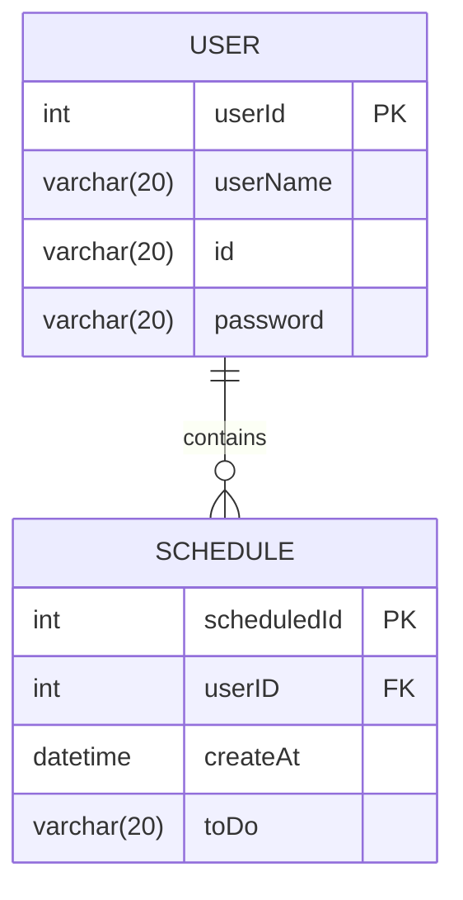

## API 명세서
| Aa 기능     | Method | URL                        | request  | response | 상태코드     |
|-----------|--------|----------------------------|----------|----------|----------|
| 스케쥴 등록    | POST   | /api/schedules             | 요청 body  | 등록 정보    | 200:정상등록 |
| 스케쥴 조회    | GET    | /api/schedules/{scheduleID} | 요청 Param | 단건 응답 정보 | 200:정상조회 |
| 스케쥴 목록 조회 | GET    | /api/schedules             | 요청 Param | 다건 응답 정보 | 200:정상조회 |
| 스케쥴 수정    | PUT    | /api/schedules/{scheduleID} | 요청 body | 수정 정보    | 200:정상수정 |
| 스케쥴 삭제    | DELETE | /api/schedules/{scheduleID} | 요청 Param | -        | 200:정상삭제 |
------
## ERD
